# Truffle Suite

Decentralized application(Dapp): Adoption tracking system for a pet shop

---

### Truffle Overview

Truffle is a collection of tools that simplifies the development of **blockchain-based** applications on **EVM-compatible networks**(EVM: Ethereum Virtual Machine). It focuses on the development of **smart contracts**, which are the foundation of EVM applications.

[**Ganache](https://trufflesuite.com/ganache):** personal blockchain for **Ethereum** development you can use to deploy contracts, develop applications, and run tests.

---

### **Setting up the development environment**

**Technical Requirements**

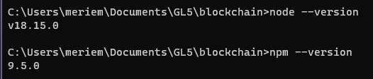

**Installing Truffle**

---

### **Creating a Truffle project using a Truffle Box**

Truffle Box : pre-configured **project template** that provides a foundation for developing decentralized applications (DApps) on the Ethereum blockchain using the Truffle framework. These boxes come with a pre-defined directory structure, smart contracts, tests, and often include front-end code as well.

- Unboxing a truffle box called **“pet-shop”**

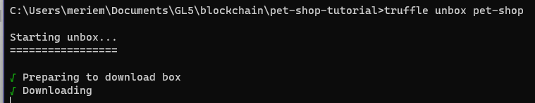

This is the project’s folder structure 

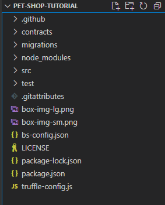

- `contracts/`: Contains the [Solidity](https://solidity.readthedocs.io/) source files for our smart contracts. There is an important contract in here called `Migrations.sol`
- `migrations/`: Truffle uses a migration system to handle smart contract deployments. A migration is an additional special smart contract that keeps track of changes.
- `test/`: Contains both JavaScript and Solidity tests for our smart contracts
- `truffle-config.js`: Truffle configuration file

---

### **Writing the smart contract**

`Adoption.sol` : back-end logic and storage

Every account and smart contract on the **Ethereum** blockchain has an address and can send and receive Ether to and from this **address**.

First, we created an Ethereum address 

Then, we wrote 2 functions

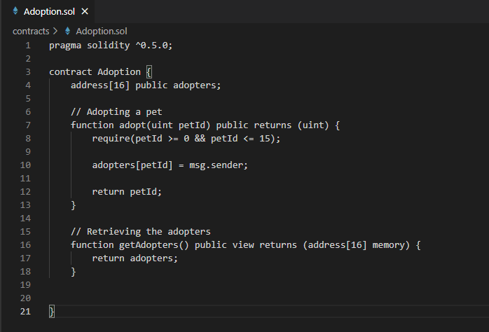

---

### Compilation

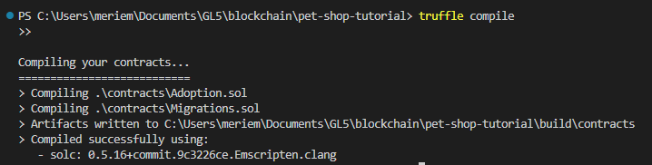

⇒ Compiled successfully 

---

### Migration

- Migrating the smart contracts to the blockchain
- **A migration is a deployment script meant to alter the state of your application's contracts**, moving it from one state to the next.
- `1_initial_migration.js:`handles deploying the `Migrations.sol` contract to observe subsequent smart contract migrations, and ensures we don't double-migrate unchanged contracts in the future.

**Downloading Ganache** 

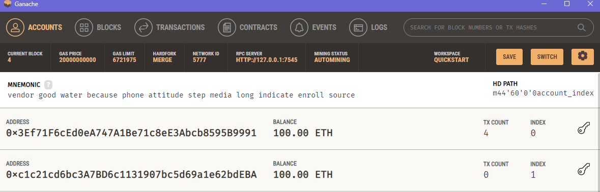

**Migrating** 

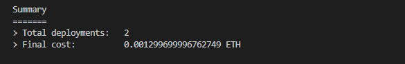

⇒ migrations executed in order

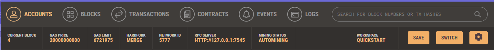

**Note :** The blockchain now shows that the current block, previously `0`, is now `4`. In addition, while the first account originally had 100 ether, it is now lower, due to the transaction costs of migration.

---

### **Testing the smart contract using Solidity**

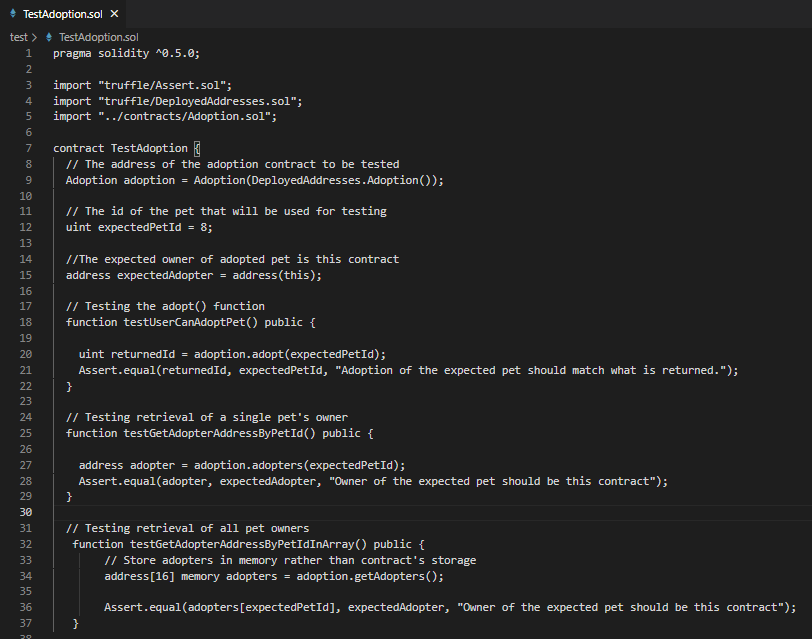

---

### Testing the smart contract using Javascript

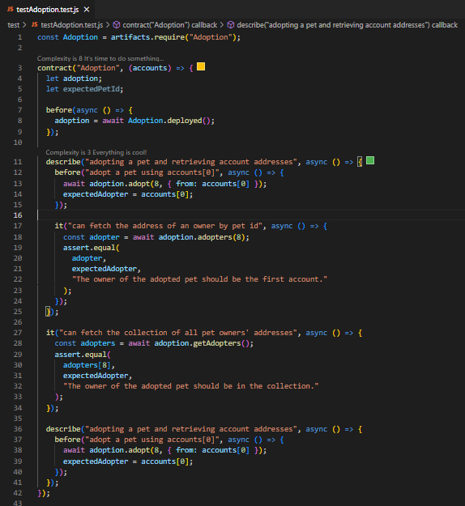

---

### Running the test

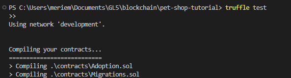

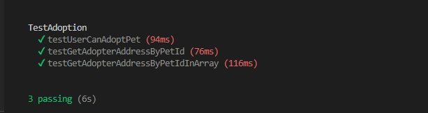

---

### **Creating a user interface to interact with the smart contract**

Downloading **Metamask** extension 

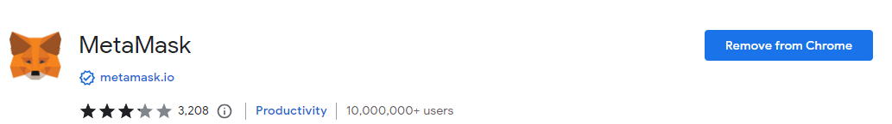

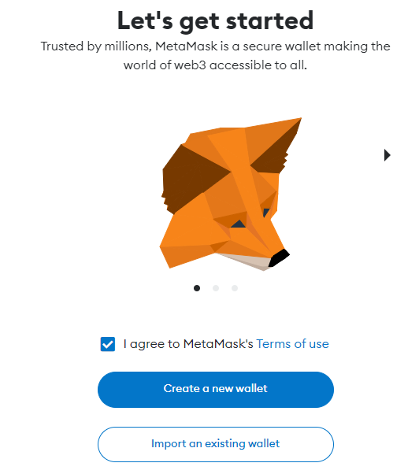

We then created a new **network** : Ganache [localhost:7545](http://localhost:7545) 

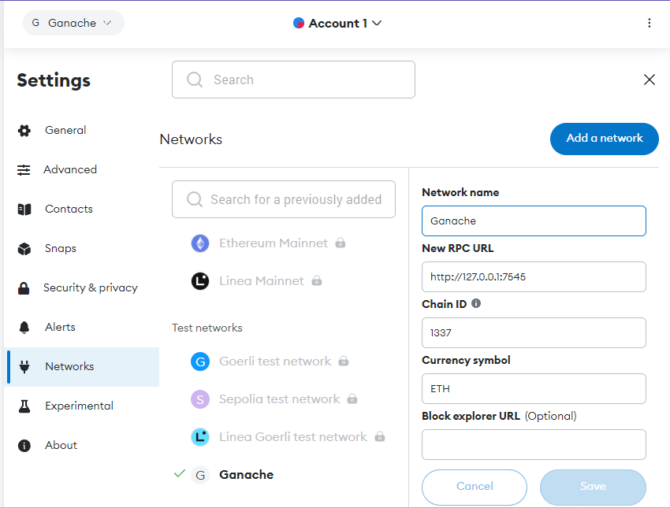

**Note : Each account created by Ganache is given 100 ether. It's slightly less on the first account because some gas was used when the contract itself was deployed and when the tests were run.**

**⇒ The Configuration is now complete.**

---

### **Installing and configuring lite-server**

- `lite-server` library : serve our static files. This shipped with the `pet-shop` Truffle Box

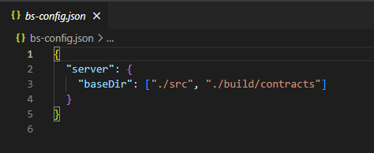

⇒ This tells `lite-server` which files to include in our base directory. We add the `./src` directory for our website files and `./build/contracts` directory for the contract artifacts.

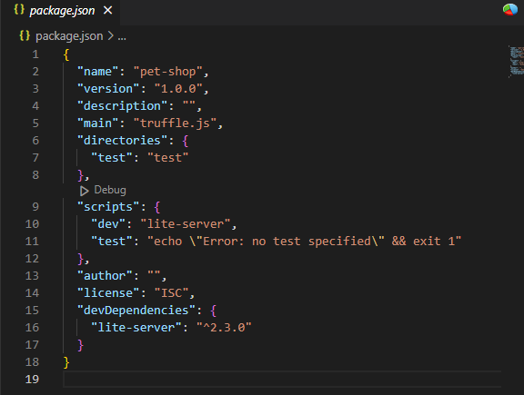

This tells npm to run our local install of `lite-server` when we execute `npm run dev` from the console.

---

### Using the dapp

- Start the local web server

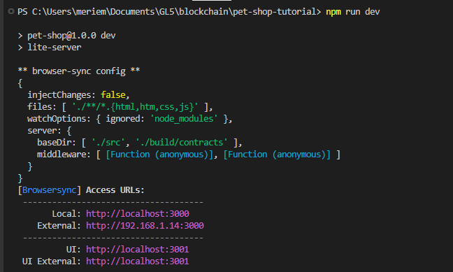

[localhost:3000](http://localhost:3000) 

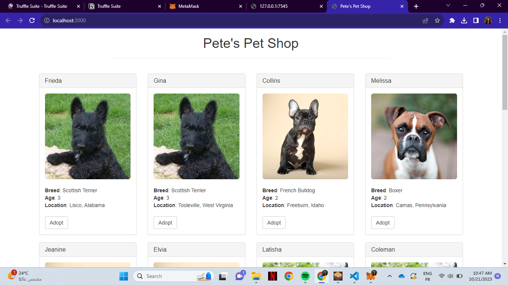

A **MetaMask** pop-up should appear requesting your approval to allow Pete's Pet Shop to connect to your **MetaMask** wallet.

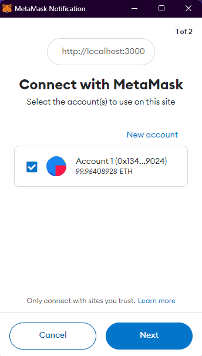

After clicking the **Adopt** button on the pet of your choice

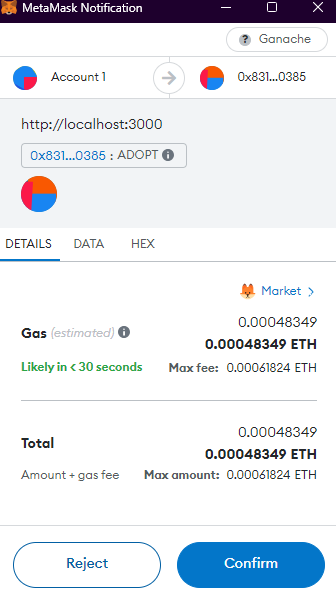

The button says **“Success”,** and in **MetaMask**

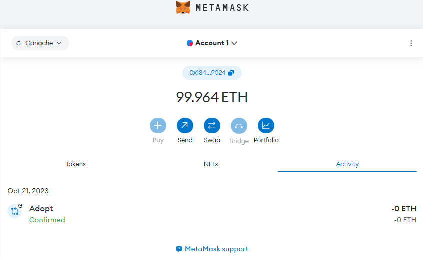

And in **Ganache**

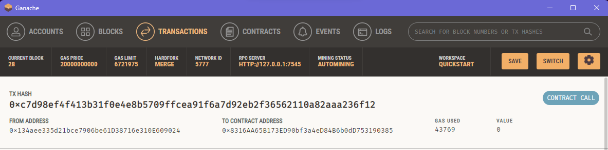